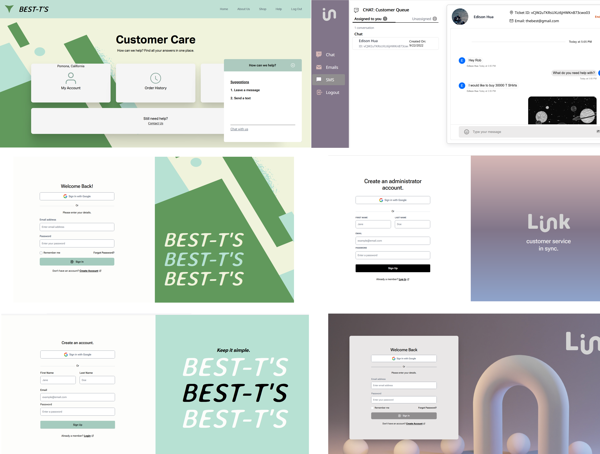

# Link Customer SaaS

A full stack application developed with Next.js, TypeScript, and a Firebase backend.

# Description
The project scenario was to design a system to triage, facilitate, and respond to customer support inquiries for B2C retailer services. We developed
a solution for businesses to scale and modernize their way of communicating with customers. 

### Design to Deployment:

### Wireframe

### Architecture

## Tools and Technologies:
### Frontend:
- Next.js
- Tailwind CSS
- Stream Chat SDK

### Backend:
- Node.js
- Firebase Firestore NoSQL Database
- Firebase Cloud Functions
- Twilio SMS API and SendGrid
- Zapier Email API
